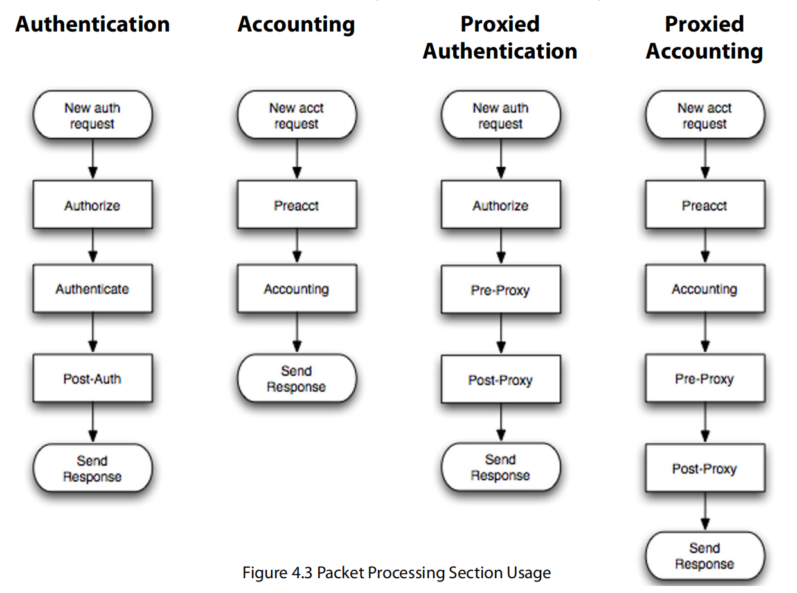

# 第四章 - 配置要求

本章描述了FreeRADIUS配置文件结构以及各个配置文件的用途：

- 核心配置文件
- **radiusd.conf** 文件
- 文件格式
- 数据包处理部分
- 用户文件

`/etc/raddb` 目录包含了配置文件。主要配置文件是名为 **radiusd.conf** 的文件，它引用了其他配置文件。FreeRADIUS包包含大量文件，其中许多配置文件是示例；其余的配置文件确保服务器在安装后能正确运行。

### 4.0 核心配置文件

配置文件位于 `raddb` 目录中。配置文件结构还包含虚拟服务器配置。服务器包含多个配置文件，以下是其中列出的几个示例。例如，每个插件模块都有自己的配置文件，虽然这些文件没有列出。以下是列出的一些最重要的配置文件，按字母顺序排列：

- **radiusd.conf**：定义了RADIUS服务器的配置参数。它引用了其他配置文件。
- **clients.conf**：定义了配置RADIUS客户端所需的信息，包括IP地址和共享密钥。该文件从 **radiusd.conf** 文件中引用。
- **dictionary**：定义了RADIUS服务器的本地属性。此文件引用了默认字典文件。默认字典文件包括数千个属性定义。
- **proxy.conf**：定义了上游主机服务器，包括信息如IP地址和共享密钥。它还定义了领域（Realms）。**radiusd.conf** 文件引用了 **proxy.conf** 文件。
- **sites-enabled/default**：这是默认的虚拟服务器。该文件处理身份验证和计费请求。它包含一个为处理最大数量身份验证协议而设计的配置。**radiusd.conf** 文件引用了 **sites-enabled/default** 文件。
- **sites-enabled/inner-tunnel**：这个虚拟服务器处理在TLS隧道内传输的身份验证方法，作为PEAP或EAP-TTLS的一部分。**radiusd.conf** 文件引用了 **sql.conf** 文件。
- **users**：传统的RADIUS用户配置文件。此文件的格式与1993年发布的文件格式相似。**files** 文件引用了 **users** 文件。


### 4.0.1 raddb 子目录

`raddb` 目录包含若干子目录，用于帮助组织配置文件：

- **certs/** 该子目录存储EAP证书。
- **mods-available/** 该目录存储模块配置文件，网络管理员可以按需启用每个模块。每个模块在目录中都有不同的配置文件。这些文件通过 **radiusd.conf** 加载。
- **mods-enabled/** 该目录存储已启用的模块配置文件。通常这些是指向 **mods-available/** 目录中文件的符号链接。
- **sites-available/** 该目录用于存储虚拟服务器配置文件，管理员可以启用这些虚拟服务器。每个虚拟服务器封装了一个逻辑功能集。
- **sites-enabled/** 该目录用于存储已启用的虚拟服务器。通常这些是指向 **sites-available/** 目录中文件的符号链接。
- **sql/** 该目录用于存储更多的SQL配置文件，支持多种数据库，如MySQL、PostgreSQL或Oracle。还有子目录用于每种SQL数据库类型。

此列表还标识了许多常用的配置文件：

- **acct_users** 存储Accounting-Request数据包的用户文件。
- **hints** 传统的RADIUS配置文件，用于为PPP或SLIP提供User-Name的一部分。
- **huntgroups** 传统的RADIUS配置文件，用于为客户端分组配置。

### 4.0.2 总体布局

本节描述的FreeRADIUS文件布局基于约定，并非服务器强制要求的。该文件布局便于查找配置中的特定部分，因为每一部分都被分成逻辑相关的组件，所有这些组件都被放在子目录中。

几乎所有列出的文件都属于主要的 **radiusd.conf** 文件。早期版本的FreeRADIUS将所有配置文件存储在一个大的 **radiusd.conf** 文件中，共计约2000行文本。这种文件聚合方式使得网络管理员在理解配置或查找特定部分时变得困难。第4.0.1节中列出的子目录是在FreeRADIUS 2.0.0版本中引入的。从版本2.0.0及后续版本开始，**radiusd.conf** 文件比以前小得多。

### 4.1 radiusd.conf 文件

**radiusd.conf** 文件包含了服务器的配置。当服务器启动时，它会读取此文件并缓存配置。数据会被解析以设置变量的值或决定其他配置项，如模块。

加载配置后，服务器接收并处理数据包。当服务器以调试模式运行时（`radiusd -X`），当前使用的配置会打印到终端窗口。这些信息包括正在读取的文件、加载的模块以及使用的文件和模块。

默认的 **radiusd.conf** 文件中定义了变量和子部分，并详细讨论了如何定义特定功能。为了节省空间，本文件只描述了常见的修改项；**radiusd.conf** 文件包含更多变量和设置值，这些内容在评论部分中与变量定义一起记录。


### 4.1.1 变量

默认的 **radiusd.conf** 文件包含大量变量（关于变量的更多信息请见默认配置文件中的注释部分）。一般来说，系统管理员不需要编辑或更改本节未讨论的任何变量。

- **user** 通常设置为 **radiusd**。配置文件应可读取，但该用户不能写入。
- **group** 通常设置为 **radiusd**。配置文件应可读取，但该组不能写入。
- **max_requests** 当服务器收到请求时，它会将请求放入内部队列进行处理。稍后，服务器会处理该请求并发送响应。未收到响应的请求会通过内部计数器进行跟踪。**max_requests** 变量防止此计数器变得过大。此功能可防止服务器因流量突增而过载。

当 **max_requests** 变量设置得过低时，服务器会丢弃新请求，直到它变得忙碌。服务器还会向控制台打印描述性错误消息，说明请求被丢弃，并建议网络管理员增加 **max_requests** 的值。

当 **max_requests** 变量设置得过高时，服务器会使用更多的内存，但没有实际的好处。一般来说，网络管理员最好将此值设置得较高，而不是过低。

将 **max_requests** 变量设置为零（0）表示没有限制响应数的上限。将 **max_requests** 设置为零并不推荐，因为它可能导致潜在的服务器过载。

由于每个客户端都发送一系列数据包，网络管理员应根据客户端的总数设置此变量。因此，可以将总客户端数乘以256，然后将 **max_requests** 变量设置为该值。未来版本的服务器可能会使用自动设置此变量的功能。


### 4.1.2 日志子节

日志子节定义了系统如何处理服务器日志消息（服务器核心产生这些消息）。

- **destination** 该变量控制服务器将日志消息写入哪里。可以设置为以下之一：
  - **files** 将日志记录到纯文本文件中，文件名由以下的 **file** 指令指定。
  - **syslog** 使用 **syslog_facility** 指令指定的设施将日志记录到syslog中。
  - **stdout** 标准输出。推荐仅在使用Daemontools时使用 **stdout**。
  - **stderr** 标准错误输出。

- **file** 服务器写入所有日志消息的文件名。默认值是 `${logdir}/radius.log`。此文件会在 HUP（挂起信号）时重新打开，以便进行日志轮换。

- **syslog_facility** 允许的值依赖于本地操作系统定义的Syslog设施。请参见 `syslog` 以获取详细信息。默认值为 `daemon`，这是大多数操作系统的通用设置。

- **auth** 记录每次成功或失败的身份验证的摘要信息。此配置可能会在将来被移除，因为它重复了 **linelog** 功能。相关的变量 **auth_badpass** 和 **auth_goodpass** 控制是否记录错误或成功的密码。出于安全目的，默认值为 `no`。系统管理员可以设置 **auth_badpass=yes**，使日志记录失败身份验证尝试中使用的密码。管理员可以查看日志文件以查看用户实际输入的密码。

- **msg_goodpass** 该自定义消息会附加到服务器发送的摘要日志消息中，当 **auth=yes** 时发送。此消息会动态扩展，并且可以包含来自任何属性的信息。

- **msg_badpass** 该自定义消息会附加到服务器发送的摘要日志消息中，当 **auth=yes** 时发送。此消息会动态扩展，并且可以包含来自任何属性的信息。它最适合用于记录用户被拒绝的具体原因，如 “用户X组无法使用NAS”。


### 4.1.3 安全子节

安全子节包含影响服务器安全的变量。虽然大多数其他变量包含诸如文件权限等信息，安全子节的变量则控制服务器如何响应感知到的攻击。

- **max_attributes** 每个请求通常包含少量的属性。然而，数据包格式允许恶意客户端在一个数据包中发送超过1000个属性。由于每个属性都会解析到内部数据结构，这些恶意数据包会导致服务器为每个请求分配多达一兆字节的内存。如果恶意客户端发送大量请求，服务器可能会迅速耗尽内存。

  **max_attributes** 值限制每个请求的属性数量。包含超过 **max_attributes** 值的请求会被丢弃，并导致服务器发出警告消息。此变量的默认值为200，足以应对所有正常操作。如果出现 **max_attributes** 警告消息，请联系管理员以确定为何发送了这么多属性。

- **reject_delay** 通常情况下，尽快响应身份验证请求是有用的。然而，这种快速响应会让攻击者有机会通过字典攻击猜测密码，每秒进行成千上万次尝试。

  **reject_delay** 参数控制服务器在发送任何拒绝响应之前等待的时间。这个延迟通常设置为1（秒）。建议将此值保留为1。如果将该值设置为0，结果将导致快速响应时间，这可能使恶意攻击者能够猜测密码。

- **status_server** 管理员发现，了解服务器是否存活并响应请求非常有用。**status_server** 配置允许服务器响应状态服务器请求。该响应可以是空的 Access-Accept 或 Accounting-Request。RFC 5997（www.ietf.org/rfc/）建议在所有客户端和服务器上使用此功能。

  代理通常在尝试确定主服务器是否存活时使用此变量。如果代理怀疑主服务器无响应，它会开始使用状态服务器请求来ping服务器。当主服务器响应这些请求时，代理会认为它是响应的。

  我们建议始终将此变量设置为 **yes**。如果将其设置为 **no**，则任何客户端都将面临更难确定是否有服务器响应的情况，且认证请求或计费数据可能会丢失。

---

### 4.1.4 线程子节

**thread** 子节定义了与子线程相关的参数。服务器的主循环使用一个线程来接收请求并将其放入队列中。然后，该线程从队列中获取请求并处理它们。

服务器因此可以执行多个任务，同时不阻塞任何任务。例如，当线程需要从数据库中读取字段时，它可能会阻塞并等待数据库响应。与此同时，其他线程可以继续运行并并行处理其他请求。这种行为提高了服务器的性能和健壮性。


然而，和所有优化一样，还是存在一些权衡。服务器使用多个变量，这些变量模仿了Apache Web服务器中类似的指令，用于控制和管理这些权衡。下面详细介绍了这些变量：

- **start_servers** 该变量定义了服务器启动时启动的线程数量。
  
- **max_servers** `max_servers` 变量控制允许同时运行的线程数。该变量是一个上限。

  我们建议将该变量设置得较高，而不是较低。如果设置过低，请求将保持排队状态，直到线程变得可用，即使CPU没有繁忙。这种延迟可能导致请求在超时之前被忽略。

  在调试模式下，可能会出现以下信息：

  ```
  Thread spawn failed. Maximum number of threads (32) already running.
  ```

  该信息可能表明 `max_servers` 变量的值需要增加。另一方面，这条线程生成失败的消息也可能是由慢服务器引起的。当所有线程都在等待数据库响应时，会出现这种情况。慢服务器是问题的根源，增加 `max_requests` 并不会解决问题；相反，增加该值会导致更多的线程排队等待数据库。

- **{min,max}_spare_servers** 这些变量控制备用线程的数量。由于每个线程需要时间来启动，因此在请求等待时最好有几个空闲线程。发生流量突增时，空闲线程数量会减少。该变量随后会生成更多线程，直到 **min_spare_servers** 数量的线程为空闲状态。当流量激增结束时，空闲线程数量会增加。如果超过了 **max_spare_servers** 数量，则会关闭部分空闲线程，直到空闲线程数恢复为 **max_spare_servers**。

- **max_requests_per_server** 该变量已被弃用。建议不要使用该变量，保持其值为零（0）。

### 4.1.5 模块子节

对于2.0版本之前的版本，**modules** 子节包含了所有加载到服务器中的模块的配置。在2.0及后续版本中，模块的配置位于 **raddb/modules** 目录中的单独文件中。建议使用2.0配置，因为它保持了该部分的最小化。

模块定义是另一个包含变量的配置部分：

``` 
module {
  variable = value
}
```

该模块由模块名称组成，如 **pap**、**chap** 或 **detail**。每个模块配置包含零个或多个 **variable** 定义。定义是特定于该模块的，并且不在不同模块之间共享。


模块也可以有子节：

``` 
module {
  variable = value
  foo {
    bar = hello
  }
}
```

这些子节是特定于某个模块的，并且不会在不同模块之间共享。

模块可以有特定的 **instances**（实例）。模块实例是共享相同功能但使用不同配置的模块版本。例如，**sql** 模块连接到SQL数据库。如果服务器需要连接到两个不同的SQL数据库，就必须有两个 **sql** 模块实例。例如：

``` 
sql {
  driver = "rlm_sql_mysql"
  dialect = "mysql"
  server = "localhost"
  ...
}
```

为了区分上面提到的两个数据库，第一个模块可以称为 **mysql**，第二个模块则由系统管理员称为 **postgresql**（而不仅仅是 **sql**）。任何对 **sql** 模块的引用都会导致服务器查找没有实例名称的配置。例如：

``` 
sql {
  database = ...
  server = ...
  ...
}
```

在这个例子中，**sql**、**mysql** 和 **postgresql** 都是 **sql** 模块的三个不同实例。

### 4.1.6 实例化子节

**instantiate** 子节控制模块加载到服务器中的顺序。通常没有模块间的依赖关系，在这种情况下服务器可以按任何顺序加载模块。然而，如果存在依赖关系，顺序就变得重要。

当模块实例化顺序很重要时，必须按顺序列出要加载的模块的名称。在下面的示例中，服务器将按顺序加载三个模块：

``` 
sql
mysql
postgresql
```

**instantiate** 子节还指示服务器加载那些没有在其他节中直接引用的模块。


### 4.2 文件格式

文件格式围绕三个基本元素构建：变量赋值、变量和模块引用、以及节（sections）。

配置文件的格式是基于行的文本。每个配置设置必须位于单独的一行。这种格式应该对任何曾见过其他Unix配置文件的人来说是熟悉的。

允许注释，且注释通过使用 `#`（井号）字符来轻松识别：任何跟随在 `#` 后面的文本都会被视为注释，并因此被解析器忽略。空格、制表符和空白行都没有意义，也会被解析器忽略。

无意中的换行可以通过在断开的行尾加上反斜杠（`\`）来取消。在下面的示例中，等号后的反斜杠强制将第一行和第二行合并为一行：

``` 
foo = \
bar
```

上述示例被解析为：

``` 
foo = bar
```

### 4.2.1 变量赋值

FreeRADIUS 通常有预定义的变量名，且这些变量有预定义的含义。例如，变量 `raddbdir` 定义了存储服务器配置文件的目录。变量的值可以是整数、字符串、文件名等。

可以使用多种格式将字符串赋值给变量。与大多数系统一样，单引号、双引号和其他字符也可以用于字符串。例如：

``` 
secret = testing123
secret = "testing 1 2 3"
secret = 'testing 1 2 3'
```

第一个示例将 `secret` 变量设置为 `testing123`。第二个和第三个示例将其设置为 `testing 1 2 3`，其中包含空格。

第二个和第三个示例之间的区别在于，双引号表示该字符串可以动态展开，而单引号表示该字符串的值将按“原样”处理，不会展开。

动态扩展在使用变量间引用时非常有用（请参阅4.2.2节，变量引用）。例如：

``` 
foo = bar  # sets variable foo to value 'bar'
other = "my ${foo}" # sets variable 'other' to value 'a bar'
third = 'my ${foo}' # sets variable 'third' to value 'my ${foo}'
```


### 4.2.2 变量引用

变量引用用于当多个变量包含相同值时。在此示例中，默认配置（第一行）定义了一个 `logdir` 变量。该目录中各个日志文件的位置随后在与 `logdir` 变量引用相关的地方引用：

``` 
logdir = /var/log/radius
...
file = ${logdir}/radius.log
...
detailfile = ${logdir}/detail
```

### 4.2.3 模块引用

模块引用使服务器加载共享模块或在服务器接收到数据包时调用该模块。此类引用仅在服务器中的特定位置使用（例如，`Authorize` 或 `Authenticate` 子节中）并且在其他地方使用时会导致错误。

### 4.2.4 节

节定义了配置变量的逻辑组。网络管理员给每个节命名并使用 `{}` 字符来括起该组：

``` 
mygroup {
  foo = bar
  other = "my ${foo}"
}
```

上面的示例定义了一个简单的名为 `mygroup` 的节，包含两个变量 `foo` 和 `other`。就像变量名一样，节名也被赋予特定的含义。在 FreeRADIUS 系统中，节名 `client` 定义了与特定 RADIUS 客户端相关联的变量集合。

要为每个客户端定义多个客户端，创建一个 `client` 节。第二个限定符，称为“实例名”，会被添加到节中，以区分同一类型的不同节。以下示例显示了名为 foo 和 bar 的两个客户端：

``` 
client foo {
  ipaddr = 192.0.2.100
  secret = testing123
}
client bar {
  ipaddr = 192.0.2.200
  secret = very_secret
}
```

有许多节类型，包括 `client`、`home_server`、`home_server_pool` 和 `realm`，它们将被服务器识别。每个节类型有一组特定的变量，可以在该节中使用。展示这些概念的示例可以在默认配置中找到，节名称、功能和变量赋值都在每行的注释中进行了文档说明。

### 4.2.5 通过引用包含文件

配置文件可以被拆分成多个部分，然后通过使用 `$INCLUDE` 指令在加载时重新组合。此指令使得配置能够引用当前文件中的特定部分。


如果引用的文件已插入文件中代替 $INCLUDE，那么以下两种配置是相同的：

1. 
``` 
foo = bar
other = "my ${foo}"
```

2. 
``` 
foo = bar
$INCLUDE other.conf
```

示例 2 中使用了 `$INCLUDE` 指令来引用 `other.conf` 文件，从而得到了与示例 1 相同的配置。

网络管理员使用 `$INCLUDE` 指令来组织配置文件。被包含的文件如果以 / 开头，则为绝对路径。否则，路径是相对于当前文件的。表 4.2.4 显示了路径的差异：

| 路径差异 | 绝对路径 | 相对路径 |
|----------|----------|----------|
| `$INCLUDE /etc/raddb/foo.conf` | `$INCLUDE example/foo.conf` |

---

### 4.3 数据包处理部分

`Processing sections` 构成了驱动服务器策略的引擎。当服务器接收到请求或发送响应时，执行一个或多个处理部分。服务器的行为和进入响应中的信息完全取决于各个部分的处理方式。

请求的处理取决于以下四个信息部分：

- 与请求相关的数据，
- 每个处理部分的内容，
- 每个处理部分关联的操作表，
- 算法本身的处理方式。

请求处理部分的内容是 Unlang 语句，已在其他地方描述（见“man unlang”）。

---

### 4.3.1 术语和定义

本节描述了服务器使用的处理算法。对于基本安装，用户无需详细了解此部分内容。


### 请求

每个请求都与多个属性列表相关联，这些请求由服务器接收。每个列表都有名称。表中给出了这些列表名称的含义。

属性通过列表名称、冒号和属性名称（例如，request:User-Name，或 reply:Class）进行引用。每个列表都有特定的用途。单独的模块可能会编辑一个或多个列表；例如，mschap模块将会把MS-CHAP属性添加到 reply 列表中。或者，管理员可以使用 "unlang" 语句直接编辑这些列表。

| 列表名称          | 描述                                                           |
|-------------------|----------------------------------------------------------------|
| request           | 包含请求中接收到的属性                                         |
| reply             | 包含将在任何回复中发送的属性                                   |
| control           | 包含服务器用作临时存储的“内部”属性。这些属性不会在请求或回复中发送 |
| proxy-request     | 包含在任何代理请求中发送的属性。其内容来自“请求”列表，代理操作前取出 |
| proxy-reply       | 包含从主服务器接收到的属性，并用来重新初始化“回复”列表       |
| coa               | 仅对 Access-Request 和 Accounting-Request 数据包有效。用于创建 CoA-Request 数据包并将其发送到 NAS。可以使用“disconnect”代替，从而发送 Disconnect-Request 数据包到 NAS |
| coa-reply         | 仅对 Access-Request 和 Accounting-Request 数据包有效。用于在发送 CoA-Request 数据包后接收 CoA-ACK 或 CoA-NAK 数据包。可以使用“disconnect-reply”代替，指代任何回复中的属性，表示发送 Disconnect-Request 数据包 |

### 处理部分

每个请求都要经过一个或多个处理部分。处理部分及其含义如下表所示。附加的描述见第 4.3.2 节。

| 处理部分         | 描述                                                       |
|------------------|------------------------------------------------------------|
| authorize        | Access-Request 数据包通过 authorize 部分进行处理，以获取“已知正确”的密码用于身份验证之前 |
| authenticate     | Access-Request 数据包通过 authenticate 部分进行处理，执行特定身份验证方法的模块 |
| post-auth        | Access-Request 数据包通过 post-auth 部分进行处理，回复发送到 NAS 之前 |
| preacct          | Accounting-Request 数据包通过 preacct 部分进行处理，以便在执行计费前对其进行标准化 |
| accounting       | Accounting-Request 数据包通过 accounting 部分进行处理，执行会计日志记录到文件、SQL 或其他会计功能 |
| pre-proxy        | 所有数据包在发送到主服务器之前都通过 pre-proxy 部分进行处理 |
| post-proxy       | 所有数据包在接收到主服务器的回复后都通过 post-proxy 部分进行处理 |
| recv-coa         | CoA-Request 和 Disconnect-Request 数据包通过 recv-coa 部分进行处理，在接收到来自 NAS 的 CoA 请求时 |
| send-coa         | CoA-Request 和 Disconnect-Request 数据包通过 send-coa 部分进行处理，在回复发送到 NAS 之前 |

#### 处理部分及其含义

每个处理部分是要执行的模块或 Unlang 语句的列表。列表是按从上到下的顺序处理的。

在某些情况下，跳过列表中的部分内容或提前退出处理是有用的。例如，如果由于策略规则发送了“拒绝”信号，通常没有必要继续处理该列表。

当执行模块时，返回代码如“reject”、“noop”或“ok”就是结果。这些返回代码控制列表的处理。下表显示了返回代码的名称及其含义：

| 返回代码        | 含义                         |
|-----------------|------------------------------|
| notfound        | 未找到信息                   |
| noop            | 模块没有执行任何操作         |
| ok              | 模块成功执行                 |
| updated         | 模块更新了请求               |

在 FreeRADIUS 中，每个处理部分都有默认的响应行为，比如“noop”通常会被忽略，“reject”会导致服务器停止处理列表等。每个返回代码都有一个优先级，“reject”的优先级比“noop”更高。

表格中的返回代码及其含义如下：

- **fail**：模块失败
- **reject**：模块拒绝请求
- **userlock**：用户被锁定
- **invalid**：配置无效
- **handled**：模块已经处理了请求

**Action Table（动作表）**列出了处理过程中常见返回代码的默认动作：

| 代码         | 动作          |
| ------------ | ------------- |
| **default**  | noop          |
| **reject**   | return        |
| **fail**     | return        |
| **ok**       | continue（优先级3） |
| **handled**  | return        |
| **invalid**  | return        |
| **userlock** | return        |
| **notfound** | continue（优先级1） |
| **noop**     | continue（优先级2） |
| **updated**  | continue（优先级4） |

**Algorithm（算法）**部分描述了服务器处理请求的步骤：

1. 服务器每次处理请求时，都会先以默认的返回代码和优先级启动请求。
2. 它通过处理过程中的各个部分，直到列表结束，最终决定是否继续到下一个部分，或是响应请求。
上面的算法描述了如何处理请求。它首先设置一个默认的返回代码和优先级，然后对于每个请求处理的部分，会评估其中的每个语句。每次评估会根据动作表返回不同的动作。若动作为“return”，则会跳出并返回当前的代码和优先级。如果动作为“continue”，则根据优先级调整返回的代码和优先级。

**evaluate** 函数可以被理解为执行某个模块（例如：mschap）或解释“unlang”语句。若某个“unlang”语句涉及子部分，算法会递归地在该子部分上运行。

接下来的部分涉及到服务器如何处理请求。服务器的请求处理过程通过一个或多个包处理部分来完成，执行 FreeRADIUS 时，服务器可以涉及以下任意一个处理部分：

- authorize
- session
- authenticate
- post-auth
- preacct
- accounting
- pre-proxy
- post-proxy
- send-coa
- recv-coa

这些处理部分定义了请求在服务器中如何逐步执行，并帮助确保服务器能够根据设置进行认证、授权等操作。
图4.3展示了不同操作所使用的各种数据包处理部分。

**认证（Authentication）**  
1. 新的认证请求  
2. 进入授权（Authorize）部分  
3. 进入认证（Authenticate）部分  
4. 进入后认证（Post-Auth）部分  
5. 发送响应

**记账（Accounting）**  
1. 新的记账请求  
2. 进入预处理（Preacct）部分  
3. 进入记账（Accounting）部分  
4. 发送响应

**代理认证（Proxyed Authentication）**  
1. 新的认证请求  
2. 进入授权（Authorize）部分  
3. 进入预代理（Pre-Proxy）部分  
4. 进入后代理（Post-Proxy）部分  
5. 发送响应

**代理记账（Proxyed Accounting）**  
1. 新的记账请求  
2. 进入预处理（Preacct）部分  
3. 进入记账（Accounting）部分  
4. 进入预代理（Pre-Proxy）部分  
5. 进入后代理（Post-Proxy）部分  
6. 发送响应

### 4.3.3认证部分

此部分描述了当服务器收到一个接入请求包并进行认证时的处理过程。

#### 授权（Authorize）部分

此部分的名称为**authorize**，历史原因导致早期的服务器没有后续认证部分，
因此更准确的描述应该是**预认证（pre-authentication）**。

授权部分处理**Access-Request**包，规范化请求，确定使用哪种认证方法，
并设置“已知正确”的密码（即在数据库中找到的有效密码）或者告知服务器请求应通过代理处理。

一旦授权部分完成对数据包的处理，服务器会检查返回的代码。如果返回代码是**noop**、**notfound**、**ok**或**updated**，
则继续进行请求处理。如果返回代码是**handled**，
则认为是某个模块已完成响应内容的处理，服务器会发送回复消息。否则，服务器会将认证视为被拒绝，并运行后认证部分。

如果认证未被拒绝，则服务器继续处理请求，查找**控制（control）**部分中的**Auth-Type**属性。
一旦找到该属性，就会执行名为**authenticate**的子部分，如上所述。
这种功能在2.0.0之前的版本中是历史性的，建议在版本2.0.0及以后使用Unlang策略，
这样更加灵活且易于理解。

**注意：**  
授权部分不应在回复中设置属性。尽管这种做法广泛传播，并且在默认配置中作为历史遗留原因存在，但它并不是一个好的策略设计。授权部分应用于定义策略，而后认证部分应用于设置回复属性。

### 会话部分（The Session Section）

会话部分用于在强制执行**Simultaneous-Use**（同时使用）或**double login detection**（双重登录检测）时执行数据库查找。仅用于**Access-Request**数据包。

| 代码（Code） | 动作（Action） |
|--------------|----------------|
| default      | fail           |
| reject       | return         |
| fail         | continue（优先级 1） |
| ok           | return         |
| handled      | return         |
| invalid      | return         |
| userlock     | return         |
| notfound     | return         |
| noop         | return         |
| updated      | return         |

**表4.3.3.1 会话部分的动作表**

### 认证部分（The Authenticate Section）

认证部分仅在服务器进行本地认证请求并且在代理时被完全绕过时使用。此部分不同于其他部分，它由一系列子部分组成，其中只有一个被执行。执行的子部分取决于**控制列表**（control list）中**Auth-Type**属性的内容。

**Auth-Type**属性也可以引用模块（例如，eap），而不是子部分，在这种情况下，只有该模块会被处理。

**Auth-Type**子部分可以包含一系列的Unlang语句，这在修改认证结果时非常有用。

**一旦认证部分（authenticate）完成，后认证部分（post-auth）会被执行。**

| 代码（Code）   | 动作（Action）             |
|----------------|----------------------------|
| default        | reject                     |
| reject         | return                     |
| fail           | continue（优先级 1）        |
| ok             | return                     |
| handled        | return                     |
| invalid        | continue（优先级 1）        |
| userlock       | return                     |
| notfound       | return                     |
| noop           | continue（优先级 1）        |
| updated        | continue（优先级 1）        |

**表4.3.3.2 认证部分的动作表**

### 后认证部分（The Post-auth Section）

后认证部分包含在认证过程成功或失败（被拒绝）之后应用的策略。

- 当认证成功时，后认证部分的内容会被处理，并与任何其他相关部分一起执行。
- 当认证失败时，服务器会查找一个名为**Post-Auth-Type Reject**的子部分，如果找到，则只执行该部分中的语句。如果没有找到该子部分，则不会进行后认证处理。

为了更新任何回复属性，建议只使用后认证部分，尽管这可能会比较复杂。许多模块只在其**authorize**方法中提供回复属性。该方法可以通过使用`Module-name.authorize`语法（例如，sql.authorize）从后认证部分调用。

### 账单部分（4.3.4 Accounting）

本节描述了服务器在接收到账单请求时的处理过程。

### 预处理部分（The Preacct Section）

预处理部分用于处理**Accounting-Request**数据包，通过标准化请求并确定是否需要代理该请求。

### **Preacct 部分**
如果该部分返回 **noop**、**ok** 或 **updated**，则会处理 Accounting 部分。否则，服务器停止处理请求，并且不会发送 **Accounting-Response** 数据包。

#### **Preacct 部分的返回代码与操作**：

| 代码         | 操作                       |
|--------------|----------------------------|
| default      | noop（无操作）               |
| reject       | return（返回，结束）         |
| fail         | return（返回，结束）         |
| ok           | continue（继续，优先级2）    |
| handled      | return（返回，结束）         |
| invalid      | return（返回，结束）         |
| userlock     | return（返回，结束）         |
| notfound     | return（返回，结束）         |
| noop         | continue（继续，优先级1）    |
| updated      | continue（继续，优先级2）    |

---

### **Accounting 部分**
Accounting 部分用于处理 **Accounting-Request** 数据包。

如果 **Acct-Type** 属性在 **control** 列表中设置，则只处理该命名的子部分。否则，整个 **accounting** 部分会被处理，而 **acct-type** 部分会被忽略。该部分的作用是检查请求是否应在处理完 Accounting 部分后转发（proxy）。

#### **Accounting 部分的返回代码与操作**：

| 代码         | 操作                       |
|--------------|----------------------------|
| default      | noop（无操作）               |
| reject       | return（返回，结束）         |
| fail         | return（返回，结束）         |
| ok           | continue（继续，优先级2）    |
| handled      | return（返回，结束）         |
| invalid      | return（返回，结束）         |
| userlock     | return（返回，结束）         |
| notfound     | return（返回，结束）         |
| noop         | continue（继续，优先级1）    |
| updated      | continue（继续，优先级3）    |

### **代理认证**

这一部分描述了服务器在接收到访问请求后如何进行代理。

#### **授权部分**

在代理认证过程中，授权部分的处理方式与正常认证过程相同。更多信息请参见第4.3.3节。

#### **代理前部分**

代理前部分用于处理在代理之前的请求。此部分适用于所有请求，包括 **Access-Request**、**Accounting-Request**、**CoA-Request** 和 **Disconnect-Request**。

如果针对不同类型的数据包需要不同的策略，可以使用 **home_server_pool** 部分来定义 **virtual_server** 条目。该虚拟服务器可以包含 **pre-proxy** 和 **post-proxy** 部分，这些部分仅在向主服务器发送请求时执行。

由于主服务器是按类型划分的，并且与发送的请求类型相关，因此此配置允许为每种请求类型定义不同的策略。

#### **代理后部分**

代理后部分用于处理来自主服务器的回复。与代理前部分一样，此部分适用于所有请求，包括 **Access-Request**、**Accounting-Request**、**CoA-Request** 和 **Disconnect-Request**。

代理后部分通常用于过滤来自主服务器的回复，以删除不合适的授权，如 VLAN 设置或 IP 地址分配。

与代理前部分一样，如果不同类型的数据包需要不同的策略，**home_server_pool** 部分可以用于定义 **virtual_server** 条目。该虚拟服务器可以包含 **pre-proxy** 和 **post-proxy** 部分，这些部分仅在向主服务器发送请求时执行。

主服务器可能不会在 **response_window** 时间内响应代理请求（见 **proxy.com** 文件）。当 **response_window** 超时后，代理请求的服务器会执行 **Post-Proxy-Type Fail** 子部分。这种行为允许管理员为响应缓慢的主服务器定义策略。

一旦代理后部分执行完毕，所有现有的回复列表中的属性都会被丢弃，代理后属性将被复制到回复列表中。这种行为允许主服务器定义默认的回复发送回 NAS。

---

### **代理会计**

#### **代理会计预处理部分**

在代理会计过程中，**preacct** 部分的处理与正常会计过程相同。更多信息请参见第4.3.4节。

### **会计部分**

在代理会计过程中，会计部分的处理与正常会计过程相同。更多信息请参见第4.3.4节。

#### **代理前部分**

在代理会计过程中，代理前部分的处理与代理认证过程中的相同。更多信息请参见第4.3.5节。

#### **代理后部分**

在代理会计过程中，代理后部分的处理与代理认证过程中的相同。更多信息请参见第4.3.5节。

---

### **授权变更 (CoA)**

#### **发送 CoA 部分**

发送 CoA 部分负责向 NAS 发送授权变更消息。这些消息将会断开用户与网络的连接。网络管理员也可以使用授权变更消息向用户的会话中添加额外的过滤规则。例如，可以设置带宽限制。

#### **接收 CoA 部分**

接收 CoA 部分用于处理来自 NAS 的 **CoA-Request** 或 **Disconnect-Request** 包。此部分可以导致请求被代理，此时将按上面描述的方式执行代理前后部分。

接收 CoA 部分接收并处理授权变更消息。此部分中的模块可以显示消息，例如，如果用户被断开连接。

---

### **简化的 radiusd.conf**

默认的配置文件包含成千上万行配置定义和注释。尽管所有这些数据最初可能显得很庞大，但服务器的配置可以非常简单。默认配置是复杂的，因为它支持简单的会计和多种认证协议。

这一节提供了一个简单配置文件的示例，展示了服务器配置的简易程度。服务器的唯一要求是：

- 监听 IP 地址和端口
- 接受来自已知客户端的请求
- 不使用任何插件模块
- 设置认证方式为“Accept”

### 简单配置示例

下面是一个简单配置的示例。将以下内容放入名为 `small.conf` 的文件中：

```
listen {
    type = auth
    ipaddr = *
    port = 0
}

client localhost {
    # 允许来自127.0.0.1的包
    ipaddr = 127.0.0.1
    secret = testing123
}

modules {
    # 不使用任何模块
}

authorize {
    # 返回 PAP 和 CHAP 的 Access-Accept
    update control {
        Auth-Type := Accept
    }
}
```

要以调试模式启动服务器，请使用 `small.conf` 文件代替默认的 `radiusd.conf` 文件。
您可以通过以下命令执行此操作：

```
$ radiusd -X -n small
```

该配置会处理所有来自 `localhost` 的 **Access-Request**，其中包含 PAP 或 CHAP 认证方法，
并返回 **Access-Accept**。

---

### 4.4 用户文件

`files` 模块通过 `users` 文件授权每个用户的请求。`users` 文件位于 RADIUS 数据库目录中。

`users` 文件将每一行以井号（`#`）开头的部分视为注释，忽略掉。

每个条目由交替出现的检查项和回复项行组成。

每个检查项或回复项是一个属性，其格式为 `name = value`。
可以在每行放置多个项。如果每行上有多个项，则项之间必须用逗号隔开。

该文件以检查项行开始：用户名后跟（可能为空的）检查项列表。
检查项行只能限定为一行。

然后是带有制表符的回复项列表（可能为空）。
回复项可以分多行指定；但是，每行（除最后一行外）必须以逗号结尾，
且回复项的最后一行不得以逗号结尾。

检查项是服务器用来匹配传入访问请求的属性列表。如果所有检查项都与传入的请求匹配，
服务器会将这些属性添加到回复中。该过程会为 `users` 文件中的所有条目重复执行。

如果传入的请求与任何一行中的检查项不匹配，`files` 模块会返回 **notfound** 回复，
表示它找不到该用户的记录。

以下是一个 `users` 文件条目的示例。它说明了一个用户名为 "bob" 的用户存在，
密码为 "hello"。当用户 "bob" 登录时，回复信息会显示 "Hello, bob"。

```
bob  Cleartext-Password := "hello"
     Reply-Message := "Hello, %{User-Name}"
```

**注意：** 特殊的用户名 **DEFAULT** 匹配所有用户名。

条目是按顺序处理的，从 `users` 文件的顶部开始。
如果条目包含特殊项 `Fall-Through = No` 作为回复属性，则在此时文件处理会停止，
如果没有匹配的条目，服务器不会继续处理。如果回复项没有包含 `Fall-Through` 属性，
它将被视为默认的 `Fall-Through = No` 属性。
如果条目包含特殊项 `Fall-Through = Yes` 作为回复属性，则处理会继续到下一个条目。

`Fall-Through` 应谨慎使用，服务器应在调试模式下进行测试，
并使用多个测试请求验证配置的条目是否按预期行为执行。

4.4.1 操作符

除了 `=` 操作符外，其他操作符可以用于检查项或回复项列表中的属性。以下是操作符及其定义的列表：

- **Attribute = Value**  
  尽管不允许作为 RADIUS 协议属性的检查项使用，但此操作符可以用于服务器配置属性（例如，Auth-Type）。它仅在没有相同属性项时为属性设置值。  
  作为回复项，它被解释为“将该项添加到回复列表，但前提是没有其他相同属性项。”

- **Attribute := Value**  
  始终与检查项匹配。在配置项中，它替换任何相同名称的属性。如果请求中没有此名称的属性，则添加该属性。  
  作为回复项，它具有相同的含义，但仅适用于回复项。

- **Attribute == Value**  
  作为检查项，它仅在请求中存在指定属性并且该属性值等于给定值时才匹配。  
  不允许作为回复项使用。

- **Attribute += Value**  
  总是与检查项匹配，并将当前属性的值添加到配置项的列表中。  
  作为回复项，属性值被添加到回复项中。

- **Attribute != Value**  
  作为检查项，它仅在请求中存在指定属性，并且该属性值不等于给定值时才匹配。  
  不允许作为回复项使用。

- **Attribute > Value**  
  作为检查项，它仅在请求中包含一个属性，且其值大于给定值时匹配。  
  不允许作为回复项使用。

- **Attribute >= Value**  
  作为检查项，它仅在请求中包含一个属性，且其值大于或等于给定值时匹配。  
  不允许作为回复项使用。

- **Attribute < Value**  
  作为检查项，它仅在请求中包含一个属性，且其值小于给定值时匹配。  
  不允许作为回复项使用。

- **Attribute <= Value**  
  作为检查项，它仅在请求中包含一个属性，且其值小于或等于给定值时匹配。  
  不允许作为回复项使用。

- **Attribute =~ Expression**  
  作为检查项，它仅在请求中包含与给定正则表达式匹配的属性时匹配。此操作符只能应用于字符串属性。  
  不允许作为回复项使用。

- **Attribute !~ Expression**  
  作为检查项，它仅在请求中包含与给定正则表达式不匹配的属性时匹配。此操作符只能应用于字符串属性。  
  不允许作为回复项使用。

- **Attribute =* Value**  
  作为检查项，它仅在请求中包含指定的属性时匹配，不考虑其值。  
  允许作为回复项使用。

- **Attribute !=* Value**  
  作为检查项，它仅在请求中不包含指定的属性时匹配，不考虑其值。  
  不允许作为回复项使用。

  4.4.2 示例

本节提供了可以包含在 `users` 文件中的 FreeRADIUS 代码示例。

1. 以下示例告诉服务器用户“bob”具有已知的有效密码“hello”，因此回复项将为空。

```
bob Cleartext-Password := "hello"
```

2. 此示例指示服务器对所有用户进行身份验证，验证文件为 `/etc/passwd`。
请注意，此示例使得 EAP 身份验证失败。

```
DEFAULT Auth-Type = System
Fall-Through = Yes
```

3. 如果请求包中包含属性 Service-Type 和 Framed-Protocol 以及给定的值，
则这些属性将包括在回复中。此示例还展示了如何指定多个回复项。

```
DEFAULT Service-Type == Framed-User, Framed-Protocol == PPP
Service-Type = Framed-User,
Framed-Protocol = PPP
Fall-Through = Yes
```

参见随服务器提供的 `users` 文件，里面包含更多的示例和注释。

4.4.3 `users` 文件故障排除

可以通过以调试模式（`-X`）运行服务器并使用 `radclient` 程序来检查 `users` 文件。
`radclient` 程序将打印出与特定条目匹配的请求。
服务器会列出匹配的条目，以便验证预期的结果。
出现问题时，可以在执行其他操作之前使用此方法。

注意编写 `users` 文件时要小心。错误配置服务器接受请求而不是拒绝请求。
请将条目放在合适的位置，仅在需要时使用 `Fall-Through` 条目。

拒绝某些请求的条目应放在文件的顶部，并且不应在其回复项中包含 `Fall-Through`。
对特定用户没有 `Fall-Through` 条目的条目应放在后面。任何默认条目应放在文件的末尾。
当服务器到达 `DEFAULT` 条目时，它将停止处理，除非该条目包含 `Fall-Through`。